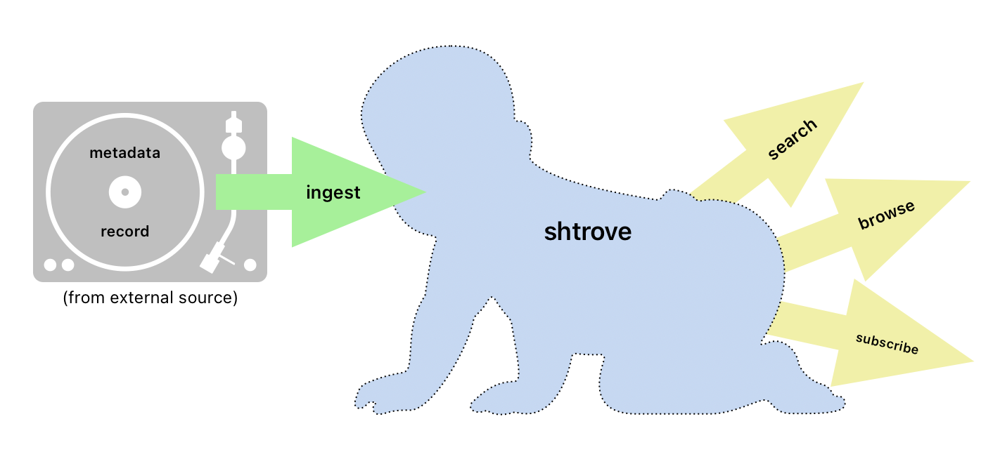
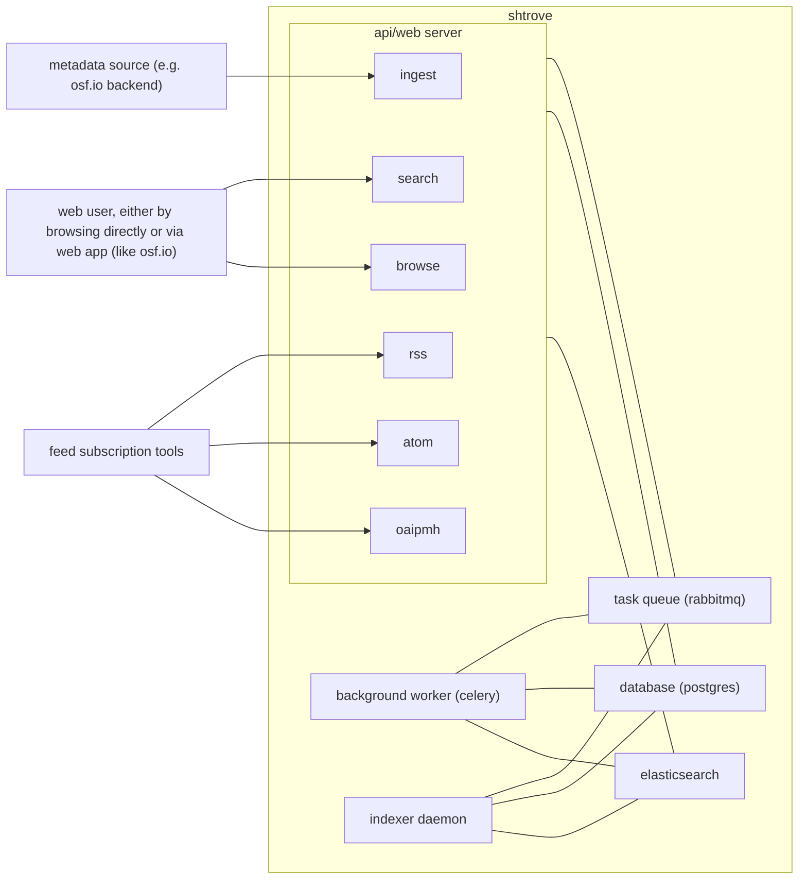

# Architecture of SHARE/trove

This document is a starting point and reference to familiarize yourself with this codebase.

## Bird's eye view
In short, SHARE/trove holds metadata records that describe things and makes those records available for searching, browsing, and subscribing.

## Parts
a look at the tangles of communication between different parts of the system:

## Code map

A brief look at important areas of code as they happen to exist now.

- `trove`: django app for rdf-based apis
    - `trove.digestive_tract`: most of what happens after ingestion
        - stores records and identifiers in the database
        - initiates indexing
    - `trove.extract`: parsing ingested metadata records into resource descriptions
    - `trove.derive`: from a given resource description, create special non-rdf serializations
    - `trove.render`: from an api response modeled as rdf graph, render the requested mediatype
    - `trove.models`: database models for identifiers and resource descriptions
    - `trove.trovesearch`: builds rdf-graph responses for trove search apis (using `IndexStrategy` implementations from `share.search`)
    - `trove.vocab`: identifies and describes concepts used elsewhere
        - `trove.vocab.trove`: describes types, properties, and api paths in the trove api
        - `trove.vocab.osfmap`: describes metadata from osf.io (currently the only metadata ingested)
    - `trove.openapi`: generate openapi json for the trove api from thesaurus in `trove.vocab.trove`
- `share`: django app with search indexes and remnants of sharev2
    - `share.models`: database models for external sources, users, and other system book-keeping
    - `share.oaipmh`: provide data via [OAI-PMH](https://www.openarchives.org/OAI/openarchivesprotocol.html)
    - `share.search`: all interaction with elasticsearch
        - `share.search.index_strategy`: abstract base class `IndexStrategy` with multiple implementations, for different approaches to indexing the same data
        - `share.search.daemon`: the "indexer daemon", an optimized background worker for batch-processing updates and sending to all active index strategies
        - `share.search.index_messenger`: for sending messages to the indexer daemon
- `api`: django app with remnants of the legacy sharev2 api
    - `api.views.feeds`: allows custom RSS and Atom feeds
    - otherwise, subject to possible deprecation
- `osf_oauth2_adapter`: django app for login via osf.io
- `project`: the actual django project
    - default settings at `project.settings`
    - pulls together code from other directories implemented as django apps (`share`, `trove`, `api`, and `osf_oauth2_adapter`)

## Cross-cutting concerns

### Resource descriptions

Uses the [resource description framework](https://www.w3.org/TR/rdf11-primer/#section-Introduction):
- the content of each ingested metadata record is an rdf graph focused on a specific resource
- all api responses from `trove` views are (experimentally) modeled as rdf graphs, which may be rendered a variety of ways

### Identifiers

Whenever feasible, use full URI strings to identify resources, concepts, types, and properties that may be exposed outwardly.

Prefer using open, standard, well-defined namespaces wherever possible ([DCAT](https://www.w3.org/TR/vocab-dcat-3/) is a good place to start; see `trove.vocab.namespaces` for others already in use). When app-specific concepts must be defined, use the `TROVE` namespace (`https://share.osf.io/vocab/2023/trove/`).

A notable exception (non-URI identifier) is the "source-unique identifier" or "suid" -- essentially a two-tuple `(source, identifier)` that uniquely and persistently identifies a metadata record in a source repository. This `identifier` may be any string value, provided by the external source.

### Conventions
(an incomplete list)

- local variables prefixed with underscore (to consistently distinguish between internal-only names and those imported/built-in)
- prefer full type annotations in python code, wherever reasonably feasible

## Why this?
inspired by [this writeup](https://matklad.github.io/2021/02/06/ARCHITECTURE.md.html)
and [this example architecture document](https://github.com/rust-analyzer/rust-analyzer/blob/d7c99931d05e3723d878bea5dc26766791fa4e69/docs/dev/architecture.md)
