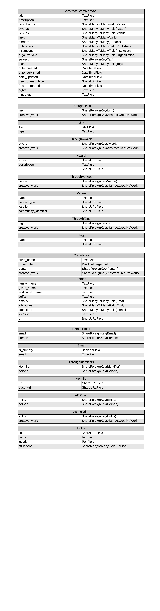

.. _share-models:

Share Models
============

Model Descriptions
------------------
The descriptions of the models used in SHARE will be useful when writing the normalizer for a new provider.
See existing provider normalizers for more detailed examples.

.. _creative-work:

Creative Work
"""""""""""""
 **Metadata Fields:**
  - title
  - description
  - contributors
   - A list of contributors associated with the work, passed to the ``Person`` class via the ``Contributor`` class::

        class Person:
            family_name = ctx.<family_name>
            given_name = ctx.<given_name>

        class Contributor:
            cited_name = ctx.<cited_name>
            person = Delegate(Person, ctx)

        class CreativeWork:
            contributors = Map(Delegate(Contributor), ctx.<contributors>)
  - awards
   - A list of awards associated with the work, passed to the ``Award`` class via the ``ThroughAwards`` class::

        class Award:
            description = ctx.<award_description>
            url = ctx.<award_url>

        class ThroughAwards:
            award = Delegate(Award, ctx)

        class CreativeWork:
            awards = Map(Delegate(ThroughAwards), ctx.<awards>)
  - venues
   - A list of venues associated with the work, passed to the ``Venue`` class via the ``ThroughVenues`` class (syntax follows the ``awards`` example above).
  - links
   - A list of links associated with the work, passed to the ``Link`` class via the ``ThroughLinks`` class::

        class Link:
            url = ctx.<url>
            # The type field must be either 'doi', 'provider', or 'misc'.
            # If the type field is always the same, it can be made Static,
            # otherwise, a function should be written to determine the link type.
            type = Static('provider')
            # OR
            type = RunPython('get_link_type', ctx.<url>):

            def get_link_type(self, link):
                if 'dx.doi.org' in link:
                    return 'doi'
                return 'misc'

        class ThroughLinks:
            link = Delegate(Link, ctx)

        class CreativeWork:
            links = Map(Delegate(ThroughLinks), ctx.<links>)
  - publishers
   - A list of publishers associated with the work, passed to the ``Publisher`` class via the ``Association`` class::

        class Publisher:
            name = ctx.<publisher_name>

        class Association:
            entity = Delegate(Publisher, ctx)

        class CreativeWork:
            publishers = Map(Delegate(Association), ctx.<publishers>)
  - funders
   - A list of funders associated with the work, passed to a ``Funder`` class via the ``Association`` class (syntax follows the ``publishers`` example above).
  - institutions
   - A list of institutions associated with the work, passed to an ``Institution`` class via the ``Association`` class (syntax follows the ``publishers`` example above).
  - organizations
   - A list of organizations associated with the work, passed to an ``Organization`` class via the ``Association`` class (syntax follows the ``publishers`` example above).
  - subject
   - A single subject associated with the work, passed to the ``Tag`` class::

        class Tag:
            name = ctx.<tag_name>

        class CreativeWork:
            subject = Delegate(Tag, ctx.<subject>)

  - tags
   - A list of tags associated with the work, passed to the ``Tag`` class via the ``ThroughTags`` class::

        class Tag:
            name = ctx.<tag_name>

        class ThroughTags:
            tag = Delegate(Tag, ctx)

        class CreativeWork:
            tags = Map(Delegate(ThroughTags), ctx.<tags>)

  - date_created
  - date_published
  - date_updated
  - free_to_read_type
  - free_to_read_date
  - rights
  - language
 **Subclasses:**
  - ``Preprint``
  - ``Manuscript``
  - ``Publication``
  - ``Project``
  - ``Registration``

Person
""""""
 **Metadata Fields:**
  - family_name
  - given_name
  - additional_name
  - suffix
  - identifiers
   - A list of identifiers associated with a person (such as an ORCID), passed to the ``Identifier`` class via the ``ThroughIdentifiers`` class::

        class Identifier:
            url = ctx.<url>

        class ThroughIdentifiers:
            identifier = Delegate(Identifier, ctx)

        class Person:
            identifiers = ctx.<identifiers>
  - emails
   - A list of emails associated with a person, passed to the ``Email`` class via the ``PersonEmails`` class (syntax follows the ``identifiers`` example above).
  - affiliations
   - A list of affiliations associated with a person, passed to an appropriate entity class via the ``Affiliation`` class::

        class Institution:
            name = ctx.<institution_affiliation_name>

        class Affiliation:
            # The entity used here could be any of the entity subclasses (Institution, Publisher, Funder, Organization).
            entity = Delegate(Institution, ctx)

        class Person:
            affiliations = Map(Delegate(Affiliation), ctx.<affiliations>)

  - location
  - url

Entity
""""""
 **Subclasses**
  - ``Organization``
  - ``Publisher``
  - ``Funder``
  - ``Institution``

Model Diagram
-------------

